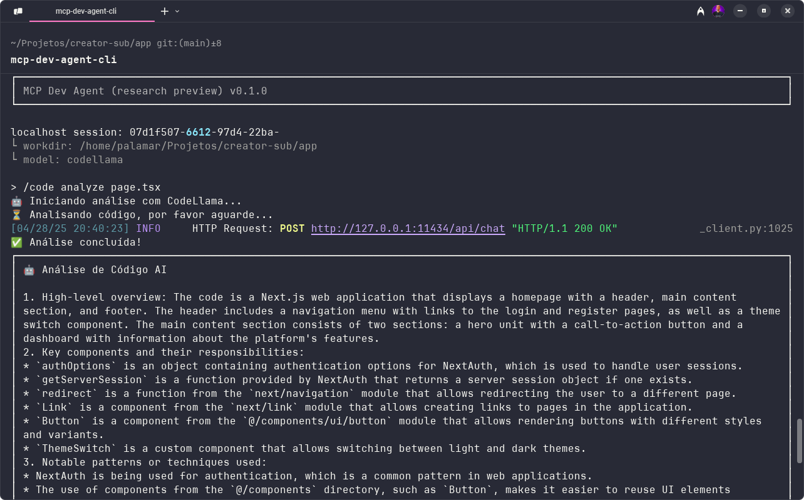

# MCP Development Agent

A development agent based on the Model Context Protocol (MCP) that provides memory management, documentation search, and Git/GitHub integration features, available both as a CLI tool and as an SSE server.



## Features

- 🧠 **Memory System**: Store and retrieve information using embeddings via ChromaDB
- 📚 **Documentation Search**: Search through documentation with AI assistance
- 🔄 **Git Integration**: Query commit history and issues
- 🔍 **Code Analysis**: Static code analysis using tree-sitter
- 🌐 **GitHub Integration**: Search repositories, issues, pull requests, projects, and code
- 💡 **AI Assistant**: Local AI-powered features using Ollama
- 💻 **CLI Interface**: Interactive command-line interface
- 🌐 **Server Mode**: Server-Sent Events (SSE) support

## Requirements

- Python 3.x
- ChromaDB
- GitPython
- FastMCP
- PyGithub
- tree-sitter
- Ollama (https://ollama.ai)

## Installation

### Global Installation (Recommended)

1. Install Ollama following instructions at https://ollama.ai

2. Pull required models:

```bash
ollama pull codellama
ollama pull llama3
ollama pull mistral
```

3. Clone and install:

For Windows:

```bash
git clone [repository-url]
cd mcp-dev-agent
.\install.bat
```

For Linux/MacOS:

```bash
git clone [repository-url]
cd mcp-dev-agent
./install.sh
```

This will:

- Create a virtual environment
- Install all dependencies
- Configure the global command `mcp-dev-agent-cli`
- Set up the required directory structure

4. Configure your GitHub token in the .env file

After installation, you can use the `mcp-dev-agent-cli` command from any git repository!

### Manual Installation (Alternative)

1. Install Ollama following instructions at https://ollama.ai

2. Pull required models:

```bash
ollama pull codellama
ollama pull llama3
ollama pull mistral
```

3. Clone the repository:

```bash
git clone [repository-url]
cd mcp-dev-agent
```

4. Install dependencies:

```bash
pip install -r requirements.txt
```

5. Configure environment variables (copy .env.example to .env):

```bash
cp .env.example .env
```

## Setting up GitHub Token

1. Go to [GitHub Personal Access Tokens](https://github.com/settings/tokens)
2. Click "Generate new token (classic)"
3. Give it a name (e.g., "MCP Dev Agent")
4. Select these scopes:
   - `repo` (Full control of repositories)
   - `read:org` (Read organization info)
5. Click "Generate token"
6. **IMPORTANT**: Copy your token immediately! You won't see it again.
7. Add it to your .env file:
   ```bash
   GITHUB_TOKEN=ghp_your_actual_token_here
   ```
8. Or set it in your environment:
   ```bash
   export GITHUB_TOKEN=ghp_your_actual_token_here
   ```

**Note**: Replace `ghp_your_actual_token_here` with the actual token you copied from GitHub.

7. Set up code parsers:

```bash
python setup_parsers.py
```

## Usage

### Global CLI

The MCP Dev Agent can be used from any git repository using the global command:

```bash
mcp-dev-agent-cli
```

This command will:

- Automatically set up required directories in your project
- Use the correct Python environment
- Maintain proper context isolation between projects

### Traditional CLI Mode

```bash
python main.py --mode cli
```

Available commands:

#### Memory

- `/memory add <content>` - Add a new general memory
- `/memory get <query>` - Search existing memories
- `/memory repo add <content>` - Add a repository-specific memory
- `/memory repo get <query>` - Search repository-specific memories

#### Git and GitHub

- `/git commits [number]` - Show commit history (default: last 5)
- `/git issues` - List local repository issues
- `/git info` - Show detailed repository information
- `/git diff` - Show pending changes (staged and unstaged)
- `/github repo <owner/repo>` - Show repository details
- `/github issues <owner/repo> [state]` - List issues (state: open/closed)
- `/github prs <owner/repo> [state]` - List pull requests (state: open/closed)
- `/github project <org> <number>` - Show project information
- `/github summarize <owner/repo> <issue_number>` - Generate issue summary using GPT
- `/github search <query> [language]` - Search code on GitHub

#### Code Analysis

- `/code analyze <file> [language]` - Analyze code structure and provides:
  - High-level overview of the code's purpose
  - Key components and their responsibilities
  - Notable patterns or techniques used
  - Potential improvements and best practices
  - Security considerations when relevant
  - Structural analysis (functions, classes, imports)

Example:

```bash
mcp-dev-agent-cli
> /code analyze src/main.py
```

#### Documentation

- `/docs <query>` - Search documentation
- `exit` - Exit CLI mode

### Advanced Features

#### Code Analysis

The system uses tree-sitter to analyze code in:

- Python
- JavaScript
- TypeScript

Analysis includes:

- Function and method extraction
- Class identification
- Import mapping
- Memory integration for context

#### GitHub Integration

- Detailed repository information
- Issue search and listing
- Pull request management
- GitHub Projects integration
- Code search with language filtering
- Enriched metadata
- Automatic issue summarization with GPT

#### Enhanced Memory System

- Support for different context types
- Enriched metadata
- Contextual search
- Temporal history
- Code analysis integration
- Automatic summary storage
- Git state contextualization

### Server Mode (SSE)

```bash
python main.py
# or
python main.py --mode server
```

The SSE server enables integration with other applications through the MCP protocol.

## Project Structure

```
.
├── main.py              # Application entry point
├── setup_parsers.py     # Code parser configuration
├── tools/
│   ├── memory_tool.py   # Memory management via ChromaDB
│   ├── doc_tool.py      # Documentation search
│   ├── git_tool.py      # Git integration
│   └── github_tool.py   # GitHub integration and code analysis
└── docs/
    └── api_reference.md # API reference documentation
```

## AI Model Configuration

The agent uses Ollama's local models for AI features. The following models are configured:

1. CodeLlama (default) - Optimized for code-related tasks
2. Llama 2 - General purpose tasks
3. Mistral - Alternative model for various tasks

The `.agent.json` file is already configured with:

- CodeLlama as default model
- Response caching (24 hours)
- Interaction logging

### Model Parameters

You can adjust model parameters by editing the `.agent.json` file:

- `temperature`: Controls response creativity (0.0 to 1.0)
- `context_window`: Maximum context length
- `top_p`: Controls response diversity

### Using Different Models

Different features use specialized models:

- Code documentation: CodeLlama
- Issue summarization: CodeLlama
- General queries: Llama 2

No API keys required - all AI features run locally through Ollama!
